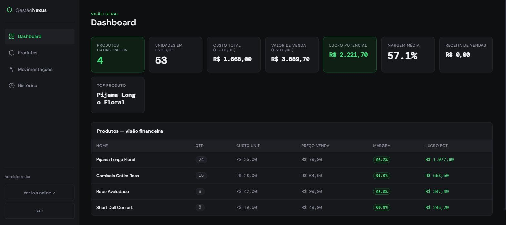
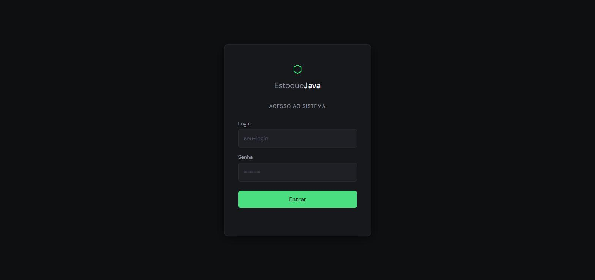

# 📦 GestãoNexus

**Sistema de gestão de estoque multi-tenant com vitrine pública (landing page),
construído em Spring Boot.** Cada empresa cadastrada tem seu próprio catálogo de
produtos, controle de entradas/saídas e histórico de movimentações — isolados
por login, protegidos por autenticação JWT e senhas com hash BCrypt.

<p align="left">
  
  
  
  
  
  
</p>

---

## 🖼️ Prints

| Dashboard | Vitrine pública | Login |
|:---:|:---:|:---:|
|  |  |  |

---

## ✨ Funcionalidades

- 🏢 **Multi-tenant** — cada empresa vê e gerencia apenas os próprios dados
- 🔐 **Autenticação JWT** com senhas armazenadas em hash BCrypt (nunca em texto puro)
- 📦 **Catálogo de produtos** com custo, preço de venda, variações de tamanho/cor e fotos
- 🔄 **Movimentações de estoque** — entradas, vendas e devoluções com histórico completo
- 💰 **Painel financeiro** — valor total em estoque e receita por período
- 🛍️ **Vitrine pública (`/loja.html`)** — landing page para os clientes finais da loja, com link direto pro WhatsApp
- 👑 **Painel administrativo** — cadastro e gestão das empresas (super-admin)
- 📱 **PWA instalável** — funciona offline e pode ser adicionado à tela inicial do celular
- 🛡️ **Segurança em produção** — sem stack trace exposto, cookies `httpOnly`/`secure`, segredos 100% via variável de ambiente

---

## 🏗️ Arquitetura

```
┌─────────────────────────────┐        ┌──────────────────────────────┐
│   Front-end (HTML/CSS/JS)   │  HTTP  │        Spring Boot API        │
│  index / login / admin /    │───────▶│  Controller → Service →       │
│  loja.html  (PWA)           │◀───────│  Repository (Spring Data JPA) │
└─────────────────────────────┘  JSON  └──────────────┬───────────────┘
                                                        │
                                          JwtFilter → SecurityConfig
                                                        │
                                                ┌───────▼────────┐
                                                │  H2 / MySQL DB  │
                                                └─────────────────┘
```

- **Controller** — expõe a API REST (`/api/**`)
- **Service** — regras de negócio (estoque, multi-tenant, cálculo de receita)
- **Repository** — Spring Data JPA
- **Security** — `JwtFilter` valida o token em cada requisição; `SecurityConfig` define as rotas públicas x protegidas
- **Front-end** — servido estaticamente pelo próprio Spring Boot (sem build separado)

---

## 🔒 Segurança — o que este projeto já resolve

| Prática | Como é aplicada aqui |
|---|---|
| Sem segredo em texto puro no código | `application.properties` só contém `${VARIAVEL_DE_AMBIENTE}` — sem valores padrão para senha/chave JWT |
| Falha rápida em vez de rodar inseguro | Se `APP_JWT_SECRET` ou `APP_ADMIN_SENHA` não forem definidos, a aplicação **não sobe** |
| Senhas com hash | BCrypt (custo 12), nunca texto puro, nunca logado |
| Tokens assinados | JWT (HS256) com expiração configurável |
| Isolamento multi-tenant | Toda consulta é filtrada pela empresa autenticada |
| Erros genéricos | Stack trace e mensagens internas nunca vazam na resposta HTTP |
| Segredos fora do Git | `.gitignore` bloqueia `.env`, `application-prod.properties`, banco de dados local e uploads |

---

## 🚀 Como rodar localmente

### Pré-requisitos
- Java 21+
- Maven 3.8+ (ou use o `mvn` já instalado)

### 1. Clone o repositório
```bash
git clone https://github.com/SEU-USUARIO/SEU-REPOSITORIO.git
cd SEU-REPOSITORIO
```

### 2. Configure as variáveis de ambiente
Veja todos os nomes e exemplos em [`application.properties.example`](./application.properties.example).
No mínimo, defina:

```bash
# Linux / macOS
export APP_JWT_SECRET=$(openssl rand -base64 32)
export APP_ADMIN_SENHA="uma-senha-forte-aqui"
```

```powershell
# Windows PowerShell
$env:APP_JWT_SECRET = [Convert]::ToBase64String((1..32 | ForEach-Object { Get-Random -Maximum 256 }))
$env:APP_ADMIN_SENHA = "uma-senha-forte-aqui"
```

### 3. Rode o projeto
```bash
mvn spring-boot:run
```

### 4. Acesse
```
http://localhost:8080          → login
http://localhost:8080/loja.html → vitrine pública
```

---

## ☁️ Indo para produção (banco real)

Por padrão o projeto usa **H2** (arquivo local, ótimo para começar). Para produção,
aponte para um banco real (ex.: MySQL) só com variáveis de ambiente — nenhuma
alteração de código necessária:

```bash
export DB_URL="jdbc:mysql://SEU-HOST:3306/gestaonexus"
export DB_USERNAME="usuario_do_banco"
export DB_PASSWORD="senha-do-banco"
export DB_DRIVER="com.mysql.cj.jdbc.Driver"
```

Adicione a dependência do driver no `pom.xml` (veja comentário em
[`application.properties.example`](./application.properties.example)) e pronto.

---

## 🚂 Deploy no Railway

O projeto já vem com `Dockerfile` e `railway.toml` prontos — o Railway detecta e builda
automaticamente ao conectar o repositório.

### 1. Crie o projeto
No painel do Railway: **New Project → Deploy from GitHub repo** e selecione este repositório.

### 2. Adicione um Volume (obrigatório)
O banco (H2 em arquivo) e as fotos de produto ficam em disco. Sem um Volume, o Railway
apaga esses dados a cada novo deploy. Em **Settings → Volumes**, crie um volume e monte em:
```
/data
```

### 3. Configure as variáveis de ambiente
Em **Variables**, defina (gere valores novos — não reaproveite os do `.env.producao.bat` local):

| Variável | Valor |
|---|---|
| `APP_JWT_SECRET` | `openssl rand -base64 32` (ou gere via `gerar-credenciais.ps1`) |
| `APP_ADMIN_SENHA` | senha forte só de produção |
| `DB_URL` | `jdbc:h2:file:/data/estoque;DB_CLOSE_ON_EXIT=FALSE` |
| `APP_UPLOADS_DIR` | `/data/uploads` |
| `APP_DATA_DIR` | `/data` (pasta do Volume; usada pela restauração de backup) |
| `APP_LOJA_WHATSAPP` | número da loja (formato `55DDDNUMERO`) |
| `APP_LOJA_INSTAGRAM` | usuário do Instagram (sem `@`) |

Não defina `PORT` nem `SERVER_PORT` — o Railway injeta `PORT` sozinho e a aplicação já lê essa variável.

### 4. Domínio
Em **Settings → Networking**, gere o domínio público (`*.up.railway.app`) ou aponte um
domínio próprio. Depois, atualize `src/main/resources/static/robots.txt` e `sitemap.xml`
trocando `SEU-DOMINIO-AQUI.com` pelo domínio real, faça commit e deixe o Railway redeployar.

### 5. Enviar o banco e as fotos do sistema local
O servidor novo nasce vazio. Para levar produtos, preços, fotos e logins do sistema local, rode no PC
onde o sistema está (com ele ligado):
```powershell
.\enviar-para-railway.ps1 -UrlRailway https://SEU-APP.up.railway.app
```
O script baixa um backup do banco local, junta com `data\uploads` e envia para `/api/admin/empresas/restaurar`
(só admin). O envio fica pendente; **reinicie o serviço no Railway** para aplicar. O banco anterior do servidor
é guardado como `estoque.mv.db.bak-AAAAMMDD-HHMMSS` no Volume. Depois da restauração, os logins e senhas
passam a ser os do banco local.

### Proteções da API pública
O login (`/api/auth/login`) bloqueia por 15 minutos após 8 tentativas erradas do mesmo IP
(ou 30 do mesmo login) e responde `429`. O IP real vem do proxy via `X-Forwarded-For`.

---

## 📚 Endpoints principais da API

| Método | Endpoint | Descrição |
|---|---|---|
| `POST` | `/api/auth/login` | Autentica e devolve o JWT |
| `GET` | `/api/produtos` | Lista os produtos da empresa logada |
| `GET` | `/api/produtos?busca=termo` | Busca por nome |
| `GET` | `/api/produtos/valor-total` | Valor total em estoque |
| `POST` | `/api/produtos` | Cadastra produto |
| `PUT` | `/api/produtos/{id}` | Edita produto |
| `PATCH` | `/api/produtos/{id}/qtd` | Ajusta quantidade |
| `POST` | `/api/produtos/{id}/imagens` | Upload de foto do produto |
| `GET` | `/api/movimentacoes` | Histórico de movimentações |
| `POST` | `/api/movimentacoes` | Registra venda / entrada / devolução |
| `GET` | `/api/movimentacoes/receita` | Receita por período |
| `GET` | `/api/loja/produtos` | Catálogo público (vitrine) |
| `GET` | `/api/admin/empresas` | *(admin)* Lista empresas cadastradas |

---

## 🗂️ Estrutura do projeto

```
GestãoNexus/
├── pom.xml
├── README.md
├── application.properties.example
├── .gitignore
└── src/
    ├── main/
    │   ├── java/com/estoque/
    │   │   ├── controller/     → API REST
    │   │   ├── service/        → Regras de negócio
    │   │   ├── repository/     → Spring Data JPA
    │   │   ├── model/          → Entidades JPA
    │   │   ├── security/       → JWT + Spring Security
    │   │   └── exception/      → Tratamento global de erros
    │   └── resources/
    │       ├── application.properties
    │       └── static/         → Front-end (index, login, admin, loja, PWA)
    └── test/
```

---

## 🛠️ Stack

Java 21 · Spring Boot 3.2 · Spring Security · Spring Data JPA · H2 / MySQL ·
JJWT · BCrypt · HTML/CSS/JS vanilla · PWA (manifest + service worker)

---

## 📄 Licença

Distribuído sob a licença MIT. Veja [`LICENSE`](./LICENSE) para mais detalhes.

---

<p align="center">Feito com 💚 para a <strong>PAFANNY</strong></p>
